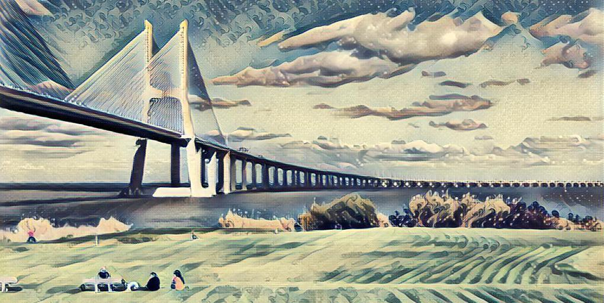

# Deep Learning e Redes Neuronais na arte

Benvindo ao workshop de Deep Learning e Redes Neuronais na Arte. Aqui vai encontrar um conjunto de instruções de configuração do seu computador para utilização no workshop e sobre a aplicação de modelos usando o [Floydhub](http://floydhub.com/)

[Requisitos](https://github.com/hjneves/deep_learning_maat/blob/master/readme/requirements.md)

[Aplicação e criação de modelos](https://github.com/hjneves/deep_learning_maat/blob/master/readme/modelling.md)

